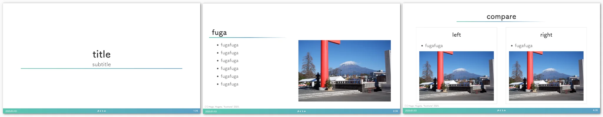

# marp-template


## preparation
for npm
```bash
npm install
```
for yarn
```bash
yarn install
```

## build
for npm
```bash
npm run build <FORMAT>
```
for yarn
```bash
yarn build <FORMAT>
```

`<FORMAT>` is one of the following:
- html
- pdf
- pptx

## edit
edit `src/README.md`
for npm
```bash
npm run start <SLIDE DIR>
```
for yarn
```bash
yarn start <SLIDE DIR>
```

After run above, you can watch the changes in [http://localhost:8080](http://localhost:8080).

- example:
    - for npm
    ```bash
    npm run start slide/
    ```
    - for yarn
    ```bash
    yarn start slide/
    ```
